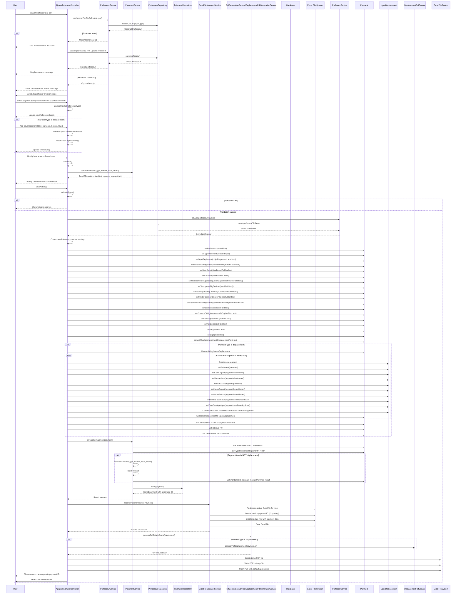

# UML Sequence Diagram for Adding a New Payment

```mermaid
sequenceDiagram
    participant User as User
    participant Controller as AjouterPaiementController
    participant ProfesseurService as ProfesseurService
    participant PaiementService as PaiementService
    participant ProfessorDAO as ProfesseurRepository
    participant PaymentDAO as PaiementRepository
    participant ExcelService as ExcelFileManagerService
    participant PdfService as PdfGenerationService/DeplacementPdfGenerationService
    participant Database as Database
    participant ExcelFile as Excel File System
    
    %% Step 1: User searches for professor
    User->>Controller: searchProfessor(cin, ppr)
    Controller->>ProfesseurService: rechercherParCinOuPpr(cin, ppr)
    ProfesseurService->>ProfessorDAO: findByCinOrPpr(cin, ppr)
    ProfessorDAO-->>ProfesseurService: Optional[Professeur]
    alt Professor found
        ProfesseurService-->>Controller: Optional[professeur]
        Controller-->>User: Load professor data into form
        Controller->>ProfesseurService: sauver(professeur) %% Update if needed
        ProfesseurService->>ProfessorDAO: save(professeur)
        ProfessorDAO-->>ProfesseurService: saved professeur
        ProfesseurService-->>Controller: Saved professeur
        Controller->>User: Display success message
    else Professor not found
        ProfesseurService-->>Controller: Optional.empty
        Controller-->>User: Show "Professor not found" message
        Controller->>User: Switch to professor creation mode
    end
    
    %% Step 2: User fills payment details and selects type
    User->>Controller: Select payment type (vacataire/heure sup/deplacement)
    Controller->>Controller: updateObjetEtReference(type)
    Controller-->>User: Update objet/reference labels
    
    %% Step 3: For déplacement, user adds travel segments
    alt Payment type is déplacement
        User->>Controller: Add travel segment (date, parcours, heures, taux)
        Controller->>Controller: Add to trajetsData observable list
        Controller->>Controller: recalcTotalDeplacement()
        Controller-->>User: Update total display
    end
    
    %% Step 4: System calculates amounts (if not déplacement or manually triggered)
    User->>Controller: Modify hours/rate or leave focus
    Controller->>Controller: calculate()
    Controller->>PaiementService: calculerMontants(type, heures, taux, tauxIr)
    PaiementService-->>Controller: TauxIRResult(montantBrut, retenuIr, montantNet)
    Controller-->>User: Display calculated amounts in labels
    
    %% Step 5: User saves payment
    User->>Controller: saveAction()
    Controller->>Controller: validateForm()
    alt Validation fails
        Controller-->>User: Show validation errors
    else Validation passes
        %% Prepare professor for saving
        Controller->>ProfessorService: sauver(professeurToSave)
        ProfessorService->>ProfessorDAO: save(professeurToSave)
        ProfessorDAO-->>ProfessorService: saved professeur
        ProfessorService-->>Controller: Saved professeur
        
        %% Create or update payment
        Controller->>Controller: Create new Paiement or reuse existing
        Controller->>Payment: setProfesseur(savedProf)
        Controller->>Payment: setTypePaiement(selectedType)
        Controller->>Payment: setObjetReglement(objetReglementLabel.text)
        Controller->>Payment: setReferenceReglement(referenceReglementLabel.text)
        Controller->>Payment: setDateDebut(dateDebutField.value)
        Controller->>Payment: setDateFin(dateFinField.value)
        Controller->>Payment: setNombreHeures(parseBigDecimal(nombreHeuresField.text))
        Controller->>Payment: setTaux(parseBigDecimal(tauxField.text))
        Controller->>Payment: setTauxIr(parseBigDecimal(irCombo.selectedItem))
        Controller->>Payment: setModePaiement(modePaiementLabel.text)
        Controller->>Payment: setTypeReferenceReglement(typeReferenceReglementLabel.text)
        
        %% Set additional fields
        Controller->>Payment: setExercice(exerciceField.text)
        Controller->>Payment: setCreanceDOrigine(creanceDOrigineField.text)
        Controller->>Payment: setCodeCgnc(codeCgncField.text)
        Controller->>Payment: setArticle(articleField.text)
        Controller->>Payment: setPar(parField.text)
        Controller->>Payment: setLig(ligField.text)
        Controller->>Payment: setMotifDeplacement(motifDeplacementField.text)
        
        %% Handle déplacement segments
        alt Payment type is déplacement
            Controller->>Payment: Clear existing lignesDeplacement
            loop Each travel segment in trajetsData
                Controller->>LigneDeplacement: Create new segment
                Controller->>LigneDeplacement: setPaiement(payment)
                Controller->>LigneDeplacement: setDateDepart(segment.dateDepart)
                Controller->>LigneDeplacement: setDateArrivee(segment.dateArrivee)
                Controller->>LigneDeplacement: setParcours(segment.parcours)
                Controller->>LigneDeplacement: setHeureDepart(segment.heureDepart)
                Controller->>LigneDeplacement: setHeureRetour(segment.heureRetour)
                Controller->>LigneDeplacement: setNombreTauxBase(segment.nombreTauxBase)
                Controller->>LigneDeplacement: setTauxBaseApplique(segment.tauxBaseApplique)
                Controller->>LigneDeplacement: Calculate montant = nombreTauxBase * tauxBaseApplique
                Controller->>Payment: Add ligneDeplacement to lignesDeplacement
            end
            Controller->>Payment: Set montantBrut = sum of segment montants
            Controller->>Payment: Set retenuIr = 0
            Controller->>Payment: Set montantNet = montantBrut
        end
        
        %% Save payment via service
        Controller->>PaiementService: enregistrerPaiement(payment)
        PaiementService->>Payment: Set modePaiement = "VIREMENT"
        PaiementService->>Payment: Set typeReferenceReglement = "RIB"
        
        alt Payment type is NOT déplacement
            PaiementService->>PaiementService: calculerMontants(type, heures, taux, tauxIr)
            PaiementService-->>PaiementService: TauxIRResult
            PaiementService->>Payment: Set montantBrut, retenuIr, montantNet from result
        end
        
        PaiementService->>PaymentDAO: save(payment)
        PaymentDAO-->>PaiementService: Saved payment with generated ID
        PaiementService-->>Controller: Saved payment
        
        Controller->>ExcelService: appendPaiement(savedPayment)
        ExcelService->>ExcelFile: Find/create active Excel file for type
        ExcelService->>ExcelFile: Locate row for payment ID (if updating)
        ExcelService->>ExcelFile: Create/update row with payment data
        ExcelService->>ExcelFile: Save Excel file
        ExcelService-->>Controller: Append successful
        
        Controller->>PdfService: genererPdfEstadoSums(payment.id) 
        alt Payment type is déplacement
            Controller->>DeplacementPdfService: genererPdfDeplacement(payment.id)
        end
        PdfService-->>Controller: PDF input stream
        Controller->>ExcelFileSystem: Create temp PDF file
        Controller->>ExcelFileSystem: Write PDF to temp file
        Controller->>ExcelFileSystem: Open PDF with default application
        
        Controller-->>User: Show success message with payment ID
        Controller->>User: Reset form to initial state
    end
```